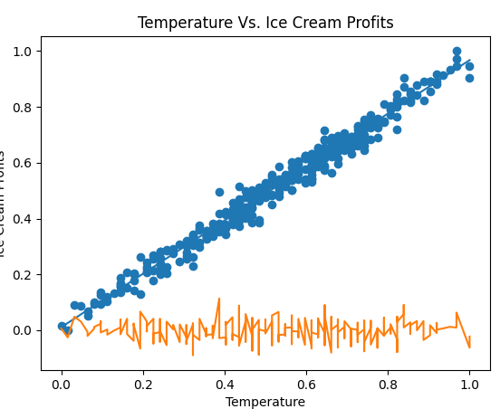

# About
This repo is my personal library for machine learning.
Here are a few things about this repo.

- I will research new and interesting topics and learn/implement them into code.

- I will also minimize the usage of other libraries mainly only using numpy and matplotlib.

>[!IMPORTANT]
>Since I will be working with csvs for training and test datasets, any csvs used will
>have an associated link in a text file pertaining to the location to which I found it.
> 
>To find this file look in the csvs folder and look for CsvLocations.md

# Currently Working Models
## Linear Regression
Linear Regression is a simple machine learning model used to find the best fit of a line.

This can then be used to visualize the correlation between an independent variable (y-axis), and a dependent variable (x-axis)[^1].
[^1]: A correlation between any two variables does not mean they are the sole cause of each others increase or decrease.

**Example**

[^2]
[^2]: The x and y values are 0-1 because they have been normalized. Normalization is when you use the min and max of a set of numbers to get
a set of numbers between 0-1 that has the same variation as the previous values. 
Normalization Formula: xnorm = x - xmin / xmax - xmin

This example shows the correlation of temperature and ice cream sales.

The blue line is the line of best fit, and the orange line shows data point variation off the line of best fit.
